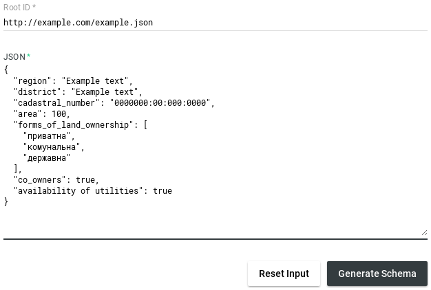

.. index:: Create_new_schema

.. _Create_new_schema:

Create new schema for 06*****
=============================

Schema fields table.

.. image:: static/tutorial/fields_table.png

For schema with pattern 06***** we need fields:
 - region
 - district
 - cadastral_number
 - area
 - forms_of_land_ownership
 - co_owners
 - availability_of_utilities

Create template using `SchemaOnline <http://jsonschema.net/>`_.
Paste fields, and generate template for schema.

Edit template
~~~~~~~~~~~~~

Template which we got on previous step

.. include:: static/tutorial/06_template.json
  :code:

Now we can add validation, description, and default value for every field.

We got such a scheme.

.. include:: static/tutorial/06_fields_with_validation.json
   :code:

Add ID
~~~~~~

Patter for schema is 06*****, so ID must have look **file:///schemas/06/schema_001.json**

Create schema for 061****
=========================

Schema fields table.

.. image:: static/tutorial/fields_table.png

We can see that 061***** template have only 1 unique field. We can inherit rest fields from parent schema.

Copy previous schema, edit fields, add one more, and edit ID.

Updated schema.

.. include:: static/tutorial/061_fields_with_validation.json
   :code:

