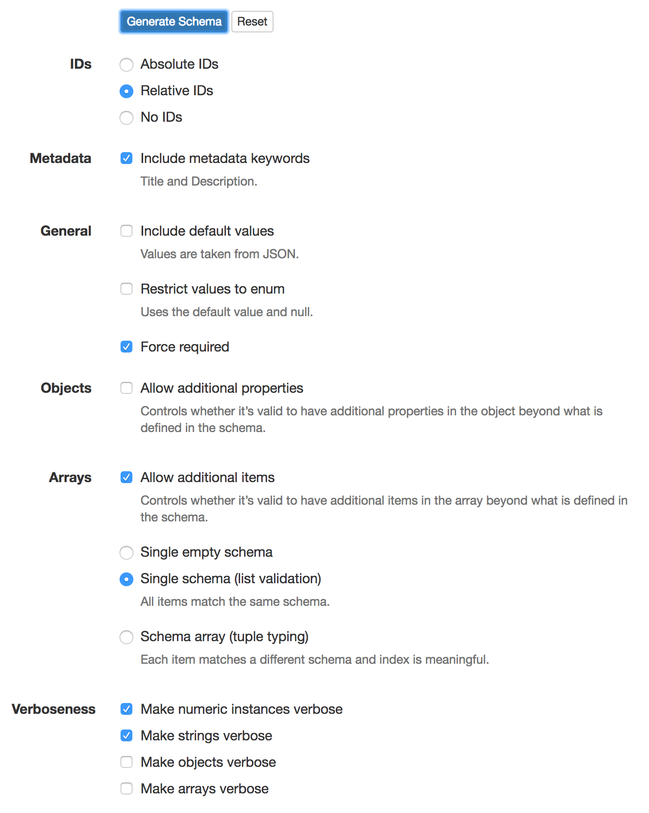
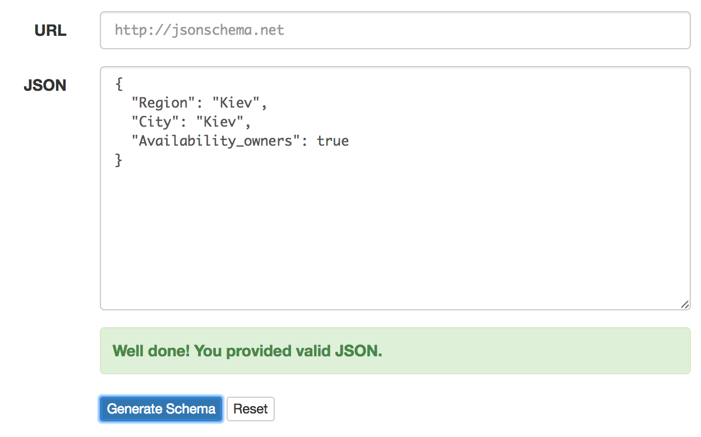

.. index:: Create_new_schema

.. _Create_new_schema:

Create new schema
=================

For creating new schema first create template on `SchemaOnline
<http://jsonschema.net/>`_.

Example setup for service.

Create schema.
~~~~~~~~~~~~~~

Pattern for new schema 06******-*, it's means that all items with CAV
classification which start with 06 and have't more specific schema will use it.

Fields for new schema:

 - Region = Kiev
 - City = Kiev
 - Availability_owners = True/False

So, open service and write your fields, and then get template.

Generate schema template and save it in file,
with name `schema_XXX.json` where XXX - is number of version.

.. code:: json

    {
      "$schema": "http://json-schema.org/draft-04/schema#",
      "type": "object",
      "title": "Root schema.",
      "description": "An explanation about the purpose of this instance.",
      "properties": {
        "region": {
          "type": "string",
          "minLength": 1,
          "title": "Region schema.",
          "description": "An explanation about the purpose of this instance.",
          "id": "region"
        },
        "city": {
          "type": "string",
          "minLength": 1,
          "title": "City schema.",
          "description": "An explanation about the purpose of this instance.",
          "id": "city"
        },
        "availability_owners": {
          "type": "boolean",
          "title": "Availability_owners schema.",
          "description": "An explanation about the purpose of this instance.",
          "id": "availability_owners"
        }
      },
      "id": "/",
      "required": [
        "region",
        "city",
        "availability_owners"
      ]
    }

Edit schema template
####################

Edit template which we create before.
Open file with schema and edit fields `title`, and `description`.

Validation
~~~~~~~~~~

For every field we can add basic validation, like `maxlength` -  max length for text field or `minlength`.
For more validation you can read `this <http://json-schema.org/latest/json-schema-validation.html#rfc.section.5/>`_.

Change ID for schema
~~~~~~~~~~~~~~~~~~~~

For editing main ID in schema get real number from schema pattern and then insert after every number '/', exception is only first two symbols.

**001** - Number schema version, set real number.

Examples:

========== ========================================
 Pattern                Schema ID
---------- ----------------------------------------
06******-*   file:///schemas/06/schema_001.json
061*****-*   file:///schemas/06/1/schema_001.json
0613****-*   file:///schemas/06/1/3/schema_001.json
========== ========================================

Relative schema fields
======================

Example you have schema by pattern 06******-*, and want create for 061*****-*.
They both have common fields `region`, `city`, `availability_owners` in our case.

schemas/06/schema_001.json

.. code:: json

    {
      "$schema": "http://json-schema.org/draft-04/schema#",
      "type": "object",
      "title": "Schema for all building",
      "description": "Example description",
      "properties": {
        "region": {
          "type": "string",
          "minLength": 1,
          "title": "Region schema.",
          "id": "region"
        },
        "city": {
          "type": "string",
          "minLength": 1,
          "title": "City schema.",
          "id": "city"
        },
        "availability_owners": {
          "type": "boolean",
          "title": "Availability_owners schema.",
          "id": "availability_owners"
        }
      },
      "additionalProperties": false,
      "id": "file:///location/schemas/06/schema_001.json",
      "required": [
        "region",
        "city",
        "availability_owners"
      ]
    }

Create schema 061*****-* but specify only one field `ownership_of_land`,
the rest import from parent schema schemas/06/schema_001.json

.. code:: json

    {
      "$schema": "http://json-schema.org/draft-04/schema#",
      "type": "object",
      "title": "Schema for all building",
      "description": "Example description",
      "properties": {
        "region": {
            "$ref": "../schema_001.json#/properties/region"
        },
        "city": {
          "$ref": "../schema_001.json#/properties/city"
        },
        "availability_owners": {
          "$ref": "../schema_001.json#/properties/availability_owners"
        },
        "ownership_of_land": {
            "type": "string",
            "enum": ["yes", "no", "in process"]
        }
      },
      "additionalProperties": false,
      "id": "file:///location/schemas/06/1/schema_001.json",
      "required": [
        "region",
        "city",
        "availability_owners"
      ]
    }
